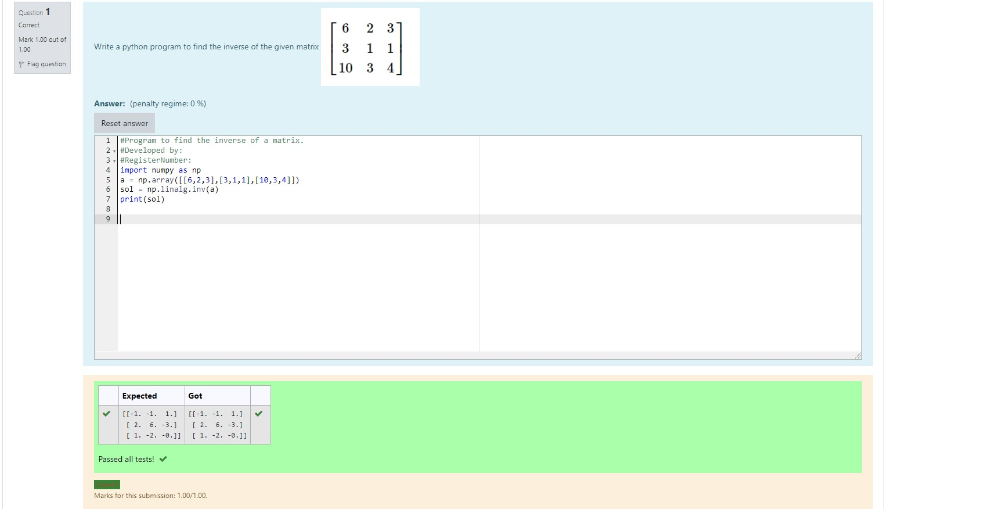

# INVERSE-OF-A-MATRIX
## Aim:
To write a python program to find the inverse of a matrix
## Equipment’s required:
1. 	Hardware – PCs
2. 	Anaconda – Python 3.7 Installation / Moodle-Code Runner
## Algorithm:
### Step1 : 
Import the numpy module to use the built-in functions for calculation.
### Step 2: 
Enter the elements of the matrix.
### Step 3: 
Calculate the inverse of the given matrix.
### Step 4: 
Print the inverse of the matrix.

## Program:
~~~
#Program to find the inverse of a matrix.
#Developed by: RAGUL.V.K
#RegisterNumber:21003061
import numpy as np
A=np.array([[2,1,1],[1,1,1],[1,-1,2]])
B=np.linalg.inv(A)
print(B)
~~~
## Output:

## Result:
Thus the inverse of given matrix is successfully solved using python program

